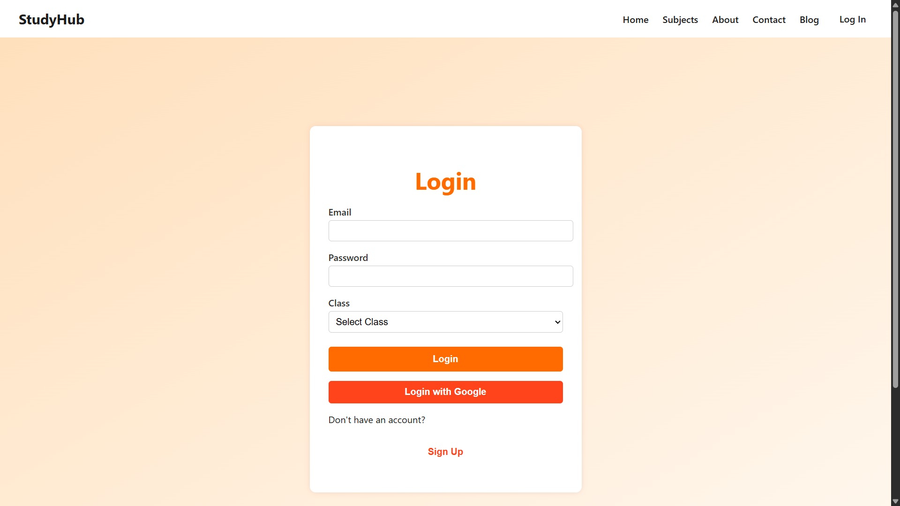
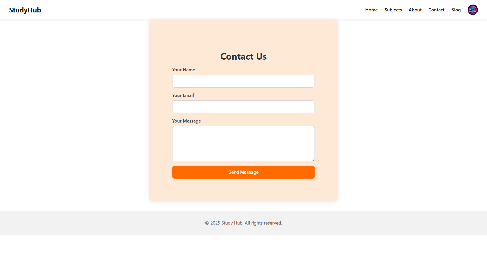
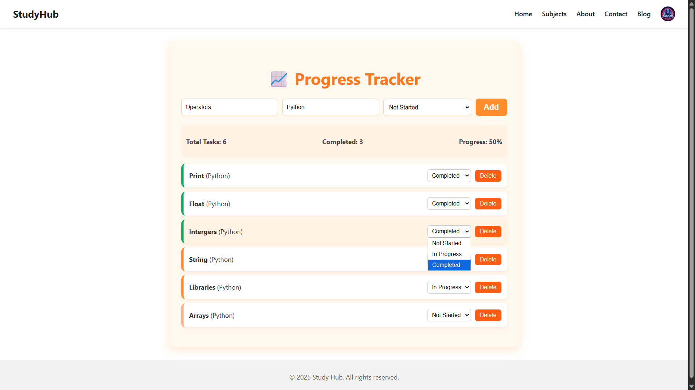

# 📚 Study Hub – Web-Based Educational Platform

Study Hub is a **centralized, interactive web platform** designed to help students organize their study materials, track assignments, and monitor academic progress—all in one place.  
Built with **React.js (Vite)** for the frontend and **Firebase** for the backend, it provides a smooth, responsive, and secure experience for students and educators.

---

## 🚀 Features

- 📝 **Rich-Text Note Editor** – Create and format subject-wise notes with images and text styling.  
- 🗓️ **Assignment & Exam Calendar** – Add and view upcoming tasks or exams with reminders.  
- 📊 **Progress Tracker** – Track completed tasks and visualize academic progress.  
- 🔒 **Secure Authentication** – Login via **Google** or **Email/Password** using Firebase Auth.  
- ☁️ **Cloud Sync** – All data stored in **Firebase Firestore** and accessible across devices.  
- 📱 **Responsive Design** – Works seamlessly on desktop, tablet, and mobile.  

---

## 🧠 Project Overview

In today’s digital age, students use multiple tools like Google Keep, calendars, and spreadsheets for studying.  
**Study Hub** combines all these tools into one easy-to-use dashboard, improving productivity and saving time.  

> “Organize Once, Focus Always.”

## Screenshots of the website
## 🖼️ Screenshots

### Homepage








---

## 🛠️ Tech Stack

| Layer | Technologies |
|-------|---------------|
| **Frontend** | React.js, Vite, HTML, CSS, JavaScript, PrimeReact |
| **Backend** | Firebase Authentication, Firestore, Cloud Storage |
| **Hosting** | Firebase Hosting or Netlify |
| **Version Control** | Git & GitHub |

---

## 📦 Installation and Setup Guide

Follow these steps to run the Study Hub project on your local system 👇

1️⃣ Clone the Repository
```bash
git clone https://github.com/Ankesh04/Study_Hub

2️⃣ Navigate into the Project Folder
cd study-hub

3️⃣ Install Dependencies
Make sure you have Node.js (v16 or higher) installed, then run:
npm install

4️⃣ Configure Firebase
Go to Firebase Console
Create a new Firebase project.
Enable Authentication, Firestore Database, and Storage.
Copy your Firebase config object from Project Settings > Web App.
Create a file named .env in your project root and add your Firebase credentials:
VITE_API_KEY=your_api_key
VITE_AUTH_DOMAIN=your_auth_domain
VITE_PROJECT_ID=your_project_id
VITE_STORAGE_BUCKET=your_storage_bucket
VITE_MESSAGING_SENDER_ID=your_sender_id
VITE_APP_ID=your_app_id

5️⃣ Run the Development Server
npm run dev
Then open your browser and visit:http://localhost:5173

🧩 Folder Structure
study-hub/
├── src/
│   ├── Components/
│   │   ├── Header.jsx
│   │   ├── Footer.jsx
│   │   ├── Home.jsx
│   │   ├── ProgressTracker.jsx
│   │   └── MyNotes.jsx
│   ├── assets/
│   ├── App.jsx
│   ├── main.jsx
│   └── firebaseConfig.js
├── public/
│   └── index.html
├── package.json
└── README.md

👩‍💻 Author

Ankesh Agarwal
B.Tech (CSE), BRCM College of Engineering & Technology
Developed during Industrial Training at Solitaire Infosys Pvt. Ltd.

🔗 GitHub: https://github.com/Ankesh04
📧 Email: osankeshagarwal4@gmail.com